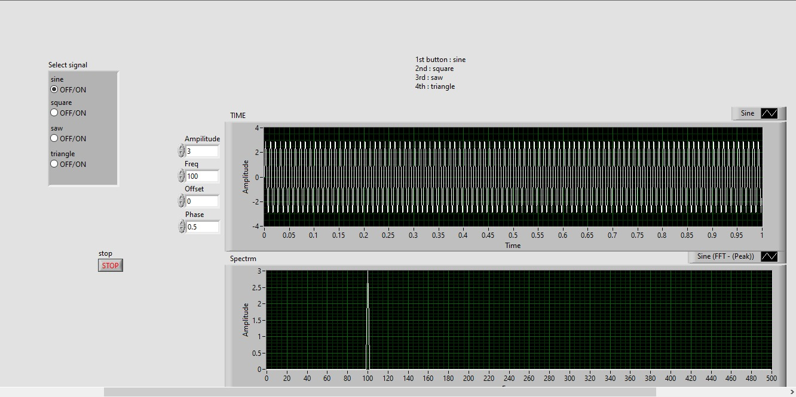
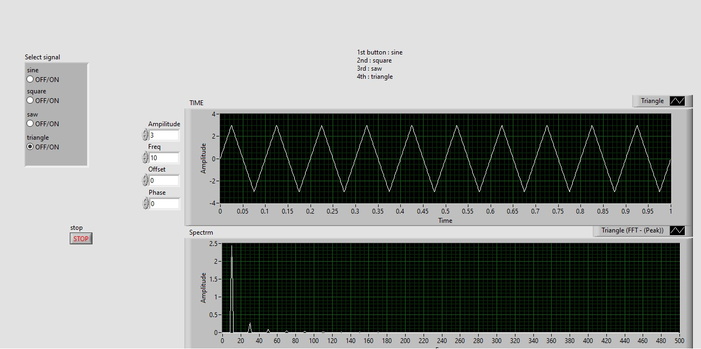

# Function-Generator
LABView project showing a function generator with spectrum analysis

## Input signal configuration

1. Sine
2. Square
3. Saw
4. Triangle

You can edit the following paramters for input signal

1. Amplitude
2. Frequency
3. Offset
4. Phase

## Examples

### Sine wave 20 Hz and ampilitude 3 units

### Sine wave 100 Hz and ampilitude 3 units

### Triangle wave

